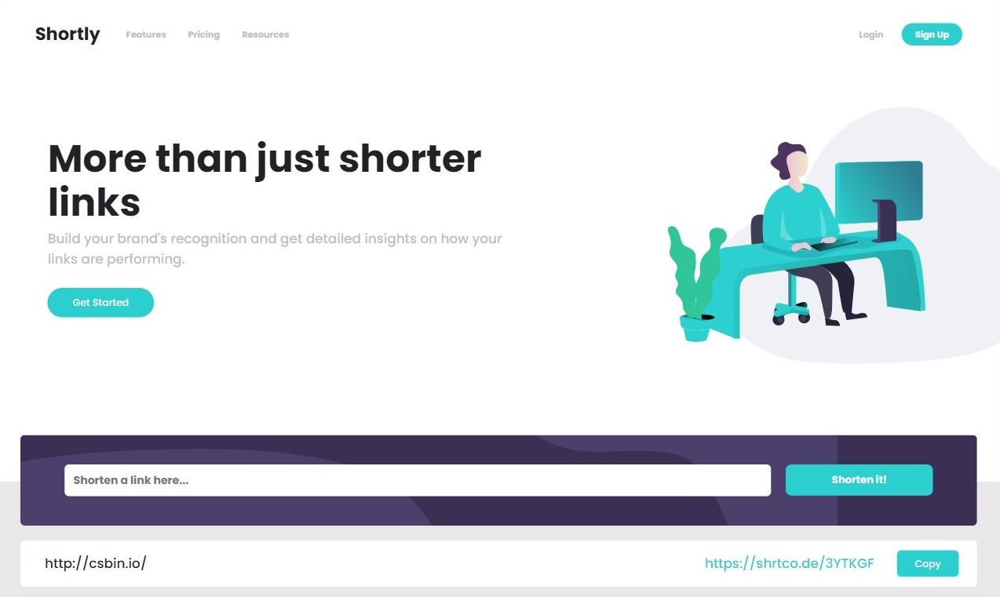
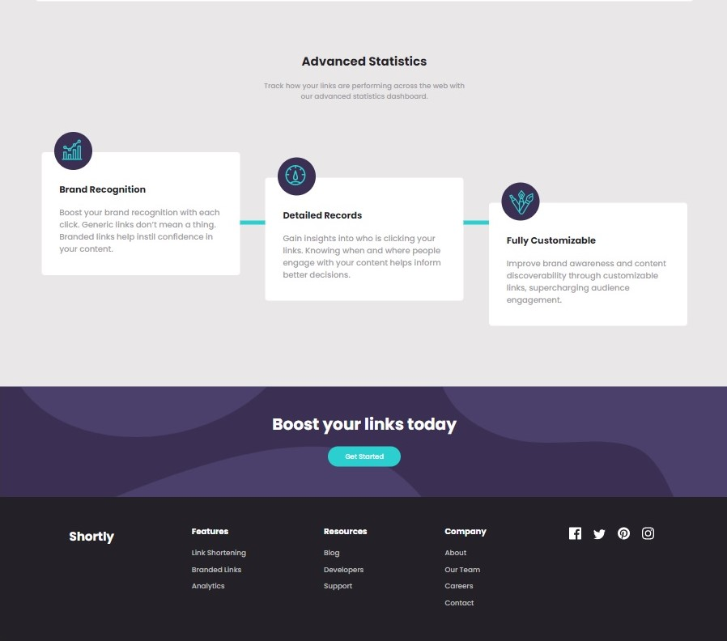

# Frontend Mentor - Shortly URL shortening API Challenge solution

This is a solution to the [Shortly URL shortening API Challenge challenge on Frontend Mentor](https://www.frontendmentor.io/challenges/url-shortening-api-landing-page-2ce3ob-G). Frontend Mentor challenges help you improve your coding skills by building realistic projects.

## Table of contents

- [The challenge](#the-challenge)
- [Screenshots](#screenshot)
- [Links](#links)
- [Built with](#built-with)
- [Useful resources](#useful-resources)

### The challenge

Users should be able to:

- View the optimal layout for the site depending on their device's screen size
- Shorten any valid URL
- See a list of their shortened links, even after refreshing the browser
- Copy the shortened link to their clipboard in a single click
- Receive an error message when the `form` is submitted if:
  - The `input` field is empty

### Screenshots

### Links

- Live Site URL: [https://nikita-bhatnagar.github.io/Url-shortener/](https://nikita-bhatnagar.github.io/Url-shortener/)

### Built with

- HTML
- CSS
- Javascript

### Useful resources

- [shrtcode API](https://app.shrtco.de/) : API used for url shortening.
